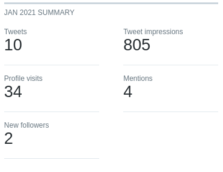

+++
date = "2021-02-28"
categories = ["retrospectives"]
tags = ["retrospectives"]
slug = "retrospective-feb-2021"
title = "Feb 2021 Retrospective"
draft = false
+++

# Summary

Added a blog to [mudmap] but am still not ready to launch. 😞

## Highlights

- Got the blog working at [mudmap]
- Backend code works as well but still has some quirks

## Goal Performance

Each month I write up how I went in the pursuit of last month's goals. It is
also somewhere I can expand on the things I've done. Helpful for historical
review and analysis.

### Add a blog to Mudmap

- **Appraisal**: Happy that Wagtail is so easy to introduce and that the blog 
  lives inside my app
- **Rating**: A

After looking around about how to deal with this I decieded on [Wagtail].

It met my requirements:

- static rendering
- supports markdown and rich text
- hosting under my control
- routable within the application

Initially I considered a few options:

- Ghost
- Hugo
- Pelican
- Plain HTML

None of those were a great fit, I really wanted to use Hugo because its a 
brilliant product (this site is built on Hugo) but I just couldn't get it to
work *how i* wanted it to. In the end I chose [Wagtail] because its built for
Django and I've used it before, so I don't need to use up one of my precious
[innovation tokens]. 

In the end, its working and let's me write in both markdown and rich text. It's
easy to make changes to the underlying HTML and CSS. It uses Jinja as the 
templating language and integrates seemlessly into the Django ecosystem. 

My routing is simple but works exactly like a typical Django url and it
is hosted on my infrastructure. Supports SEO optimization out of the box as
well. Nothing is perfect but this seems pretty great so far. Only complaint is
my shabby formatting and design!

### Complete Mudmap's backend PoC

- **Appraisal**: It works but there's a lot of polish (and bugs) to iron out
- **Rating**: B

I am happy with the proof-of-concept. By month's end the backend and dashboard
could:

- Register a new device in the database
- Make the initial connection
- Install the API package
- Install a service account user
- Retrieve system information and display it in the dashboard
- Update a registered device, or delete it

### Gain 5 Twitter followers

- **Appraisal**: I need to actually provide useful content to readers!
- **Rating**: F

In hindsight, its kind of a crap metric. I do believe in having an audience,
hence why I am electing to publicise my work (good and bad). But, I don't know
that holding myself to a follower count improvement is a good goal. It should
probably be the by-product of other goals such as *write a long form blog post*
or some other value add for any readers. 

## Recommendations

I really enjoy listening to [Nick Janetakis]' [Running in Production] podcast.
In particular, I throughly enjoyed his [interview] with Justin from [ButtonDown].
It's good advertising too because I pretty much immediately signed up for his
service - I will always support the indie creator in favor of the big tech
companies. 

Otherwise, I watched a documentary on YouTube about animals returning to Chernobyl.
I highly recommend it, family friendly too - it's like [Milo and Otis] for those
that have now grown up!

[Wildlife Takeover: How Animals Reclaimed Chernobyl][video]

## Wrap up

**What can I do better?**

- If I am going to publish things to twitter, make sure they're actually of value to any readers
- Be more focused; I need to prioritize features that will deliver the MVP in the least amount of time

**What have I done well?**

- Used my previous experience with a product (Wagtail) to make a quick integration instead of pursuing the traditional developer move of trying something new
- Learnt a great deal about Django Rest Framework; pretty happy with its performance.

## Next months goals

- Finish the copywriting on [mudmap]'s landing page
- Integrate Stripe as the payment processor
- Write a blog post for [danielms] and [mudmap]

[Nick Janetakis]: https://nickjanetakis.com/?ref=danielms.site
[Running in Production]: https://runninginproduction.com/?ref=danielms.site
[ButtonDown]: https://buttondown.email?ref=daniems.site
[interview]: https://runninginproduction.com/podcast/70-buttondown-lets-you-build-grow-and-launch-your-email-newsletter?ref=danielms.site
[Milo and Otis]: https://www.youtube.com/watch?v=JZSqJWeZXaA?ref=danielms.site
[video]: https://www.youtube.com/watch?v=XaUNhqnpiOE?ref=danielms.site
[Wagtail]: https://wagtail.io/?ref=danielms.site
[innovation tokens]: http://boringtechnology.club/?ref=danielms.site
[mudmap]: https://mudmap.io?ref=danielms.site
[danielms]: https://danielms.site?ref=danielms.site
