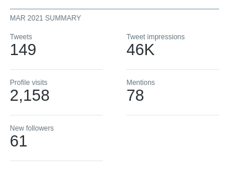

+++ 
date = "2021-04-02"
categories = ["retrospectives"]
tags = ["retrospectives"]
slug = "retrospective-march-2021"
title = "March 2021 Retrospective"
draft = "false"
+++

# Summary

Launched [Mudmap]'s landing page and blog! So far its been going very minor
traffic but that is okay - it is still in development. I did however get an
email from a potential client asking to join in a beta in the meantime. That
sort of feedback really fuels the fire and has me working hard to get the MVP
out the door as fast as reasonably possible.

## Highlights

- Deployed [Mudmap]'s landing page!
- Started the implementation of a React frontend for the application.

## Goal Performance

Each month I write up how I went in the pursuit of last month's goals. It is
also somewhere I can expand on the things I've done. Helpful for historical
review and analysis.

### Finish the copywriting on mudmap’s landing page

- **Appraisal**: Deployed the entire landing page!
- **Rating**: A+

The copy is not perfect, and I will need to refine it continually, but it is
out there and getting read by potential customers.

I had originally written all the copy in Django templates, and it seemed to
take a lot longer, and be more prone to ugliness than I was happy with. Most of
this is due to my lack of design skills. Nonetheless, I started a quick google
for some Hugo themes and found a great one that suited my style.

Within 48 hours, I had cloned the theme repo, created my own `website` repo and
deployed it to Netlify. It is now being indexed by google and something I can
work with to produce content that might attract more users in the future.

I listened to a podcast that featured Pierre De Wulf
of [ScarpingBee.com][scrapingbee] and was inspired by his experience running a
SaaS business that failed. He was able to sell it because it was generating a
lot of traffic. Pierre, said that their content marketing was what made it
sellable.

It made me realize that everything that holds value is an asset, and valuable
things can be created anywhere and from the seemingly inconsequential. That's
why I launched the site prematurely, it's a way to start raising awareness,
keep me motivated and perfect my craft while no one really cares.

### Integrate Stripe as the payment processor

- **Appraisal**: Abandoned it for now as I am ripping out templates and
  replacing them with a React and Django SPA for the dashboard
- **Rating**: F

I spent a lot of time on this, and it was one of those *nail in the coffin*
moments for the template system. I was getting frustrated with all the inline
javascript in [Mudmap] already, and it was made worse with Stripe. Not Stripe's
fault, just the way it has to be.

So, in a way this **F** score has actually been a blessing - part of the reason
I never look back on things with regret, only as a learning opportunity. This
helped set me down the path of React for the dashboard, and once I knocked out
a quick Proof-of-Concept I knew that it was *the* way forward for the sort of
user experience I need to offer my future users.

Stripe seems to have a superb React package as well which will hopefully made
the integration (hopefully this month - April) much easier.

### Write a blog post for danielms and [Mudmap]

- **Appraisal**: I wrote [Mudmap]'s first blog post but did not write one for
  this blog. I have been prioritising [Mudmap] and with so little time between
  that, family and my day job, something has to give.
- **Rating**: B

I like writing. But, I also like making things, and the fire under my feet to
deliver [Mudmap] is so strong right now. The only things I will not budge on
are my monthly Retro's and weekly [WhatGotDone]'s.

However, I did produce a [blog for Mudmap][blog]. It explains the rough genesis
and intent of [Mudmap] and is a bit of taste of blog deployment for me too.

In the future, blog post's need to follow a deployment flow. The flow might
look something like:

1. Write and deploy to the site
2. Send out a newsletter to subscribers to let them know
3. Send a Twitter post from the [Mudmap Twitter][mm_twitter] account

At the moment it is all very manual which will lead to problems in the future.
How I automate this, I am not sure just yet but possibly via a GitHub action
workflow.

## Recommendations

I found [KneesOverToesGuy][kotg] the other day. His story and achievements in
the field of human performance are both contrarian and extraordinary. Worth a
look if you want to see a cool story.

A show worth watching is the documentary, [Sherpa]. It's currently on Netflix,
at least in Australia (I won't drop a link because it'll be gone or different
for you, no doubt). It highlights the difficulties and conditions the Sherpa
face during Everest expeditions. Personally, the whole everest scene has become
a shambles - pictures of people attempting to summit with the helmets on
backwards and *climbers*
only learning what a jumar is at basecamp indicate its now just a tourism
operation.

Also, if you're an indie hacker or thinking about starting an online business,
check out [Arvid Khal][arvid]'s book [Zero to Sold][sold]. I'm listening to the
audible version and have found it to be a fantastic resource.

## Wrap up

**What can I do better?**

- Research topics before getting straight into coding, for example, I was going
  to integrate Auth0 when I already have 90% of session authentication already
  handled
- Set Twitter boundaries, and use that *scroll* time for development of ideas
  instead

**What have I done well?**

- Deployed the landing page (without fear of *what people think*)
- Be open about my past work history online - something for years I have hidden
  away
- Managed my time between Mudmap and my family

### Side Notes

Last month, I assessed a goal from January - to gain five Twitter followers.
Well this month, rather unexpectedly, I grew that quite significantly.

I think my follower count went from 30 to 89 with engagements and impressions
skyrocketing. I attribute this to one thing; engaging with others. In the past
I have treated Twitter like I have treated my general life, that is to say,
avoiding people.

Mostly, I have avoided talking about myself, or things I have done yet hoping
people would just *notice* what I have done. This just isn't how the world
works, not on Twitter, not in life, not anywhere. Two things come to mind here:

1. [The squeaky wheel gets the oil,][oil]
2. [Disagreeable people get further in life.][disagree]

Do you need to be disagreeable to get by in the world, not really but you
definitely need to stand from something and have opinions. My main point here,
is that silently consuming and never producing, and never engaging is not an
effective strategy.

So, that is why I am committing more of my mental reserves to opening myself up
to world. This also means breaking a conditioned fear drummed into me from my
years in the special forces; going public about who you are, and what you've
done or are doing.

In my past life, nearly ten years, I ran a cover story for meeting people. I
played in a Hockey team for 5 years and none of them knew what I really did. My
parents didn't really know. It's just the culture of that system - working in
the shadows. It has its place and is a necessity but eventually you leave that
world and need to remove those protective walls. For me, it starts with Twitter
and [Mudmap].

## Next months goals

- Deploy Mudmap's application for beta testing
- Write a blog post about pfSense
- Increase Mudmap's marketing

[mudmap]: https://mudmap.io?ref=danielms.site
[danielms]: https://danielms.site?ref=danielms.site
[whatgotdone]: https://whatgotdone.com
[scrapingbee]: https://scrapingbee.com
[blog]: https://mudmap.io/blog/introducing-mudmap-a-pfsense-cloud-management-tool/
[mm_twiiter]: https://twitter.com/mudmapio
[kotg]: https://instragram.com/kneesovertoesguy/
[disagree]: https://www.youtube.com/watch?v=uW8kBBqc5Zk
[oil]: https://www.forbes.com/sites/blakemorgan/2016/12/05/a-squeaky-wheel-gets-the-grease-and-why-it-pays-to-be-an-angry-customer-2/
[sherpa]: https://en.wikipedia.org/wiki/Sherpa_(film)
[arvid]: https://twitter.com/arvidkahl
[sold]: https://thebootstrappedfounder.com/zero-to-sold/?ref=danielms.site
