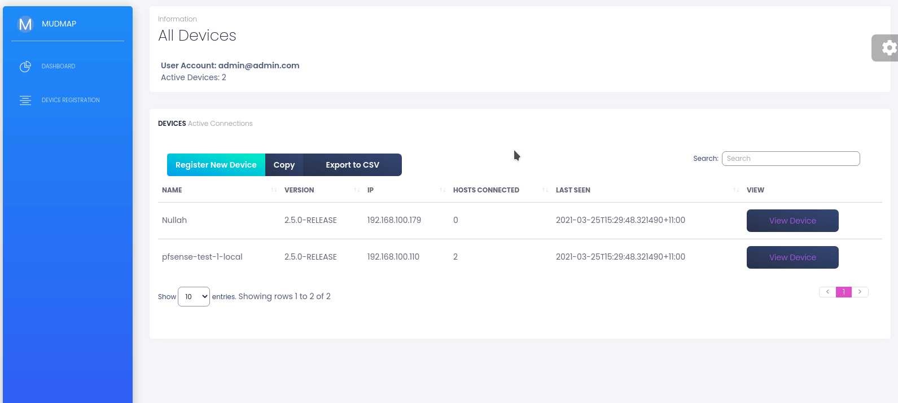

+++
date = "2021-05-02"
categories = ["retrospectives"]
tags = ["retrospectives"]
slug = "retrospective-april-2021"
title = "April 2021 Retrospective"
draft = false

+++

# Summary

Wrote a lot of [Mudmap]'s new frontend, integrated it with the backend, and
published another blog post for the site. I did not get all that I wanted to be done
within the month, though. 

Made the transition from using [Stripe] to [Paddle] after a wonderful exchange of
Tweets which led to a phone call with Paddle. They were incredibly helpful and
offered some points of refinement for the business. It cemented my commitment
to Paddle as I was treated like a valuable addition to their cause, instead
of a faceless and numbered money-generating object.

## Highlights

- Integrated the new dashboard
- Published a post and sent out a newsletter for [Mudmap]
- Finished the MVP feature-set for [Mudmap] minus the payment system

## Goal Performance

### 1. Deploy Mudmap's application for beta testing

- **Appraisal**: Did not complete all the tasks necessary to do this 😞 
- **Rating**: D

Why a *D* if I failed to launch it? Seems pretty binary.

I accomplished a lot during this month and although the goal wasn't completed, 
I am reluctant to call it a *failure*. Having a time box around this really
helped to keep me focused, made it easy to cut distractions, and in general, 
pushed me hard to achieve it. That is not a failure in my eyes. 

So what did I get done? 

- Added `structlog` for better logging management (also have Sentry)
- Improved the SSH Client error and timeout handling
- Reworked the device registration flow in the front and back end
- Built the React frontend sign in/out, registration, etc from scratch
- Integrated `dj-rest-auth` after wasting time rolling my own cookie auth
  - This took a lot of time out of the month but it gave me so much for free that it was worth it
- Replaced `fetch` with `axios` on the frontend to make JWT's so much easier to manage
- Began the [Paddle] integration

More importantly, what *didn't* I get done that prevented this from being a 
success (i.e. launching the MVP on time):

- Payment integration
- Underlying API tweaks (namely around the installer redundancy)
- Deployment testing (I see some initial difficulty getting [Traefik] and [netlify] to play nice)

Will I knock it out this month? I really do hope so! 

#### Demonstrating functionality

Here is a short clip of the dashboard's device detail in action. It's a bit neater
now, but the rough functionality is the same. It will at a glance give you up-to-date
information about the pfSense system, as well as let you start, stop or 
restart system services.

### 2. Write a blog post about pfSense

- **Appraisal**: Done!
- **Rating**: A

[What is pfSense?][blog]

A pretty easy goal but important. If I did not set this, I would not have done 
any content marketing for [Mudmap] because I spend all my time down in weeds writing code
instead.

I like writing, but it is definitely not something that I am gifted at.
It is very humbling when you think you know a subject but struggle to write 
about it in a coherent and concise manner. Though, that is why you have to 
keep producing and perfecting it as a craft.

### 3. Increase Mudmap’s marketing

- **Appraisal**: Average to poor - didn't prioritise this as I should have
- **Rating**: C

I wrote a blog post, publicised that on Twitter, and pushed out a newsletter to
my audience of zero! Can only go up from here. Now as I reflect, I see that 
focusing so hard on knocking out code, so I can launch the MVP is also a bit of 
a trap. The more marketing I do, the more awareness, the more feedback
and, the more validation I will get. 

On the topic of emails, I did find a great email template generator; [mjml]. 
I have not used it for any of my emails just yet, but it looks brilliant. Trying
to style an email (in my opinion) is a complete tyre-fire.

I am, however, working on my Twitter game. It's been a lot of fun so far. Trying
to write short 280 character messages that convey meaning is a lot harder than
I originally thought. Having to word things carefully has been great for my 
communication skills - especially as our society's attention spans continue to
rapidly decrease. It serves as my primary marketing platform for [Mudmap] at 
the moment as well - something that will need to be adjusted as time goes on.
This makes it an important skill to refine and work on which is why I am investing
in it.

## Recommendations

I listened to Lex Friedman's podcast; [176 Robert Breedlove][btc]. Even if you
aren't into bitcoin, it is a wonderful podcast with some interesting views on 
the current state of the financial world. I highly recommend it, if you're only
slightly interested in finance.

Not a recommendation. A sad note. I am getting older! I am now working with 
a lot of people that have never seen Home Alone or Jurassic Park. Thankfully, the guy
next to me is my age and *we* can reminisce about the glory days of movies 🤣

I've nearly finished [The Three Body Problem][ttbp]. It's a great book, even if
most of the physics is above my pay grade (it is still understandable). I am 
already looking forward to the next book in the trilogy. I usually read non-fiction
but have opted for fiction before bed these days as I need to unwind. 

This month I learned of [litestream]. I think it's a project that has real potential - not 
every application needs Postgres or some other server-based SQL solution.
For a great introduction, see this Tweet.



## Wrap up

**What can I do better?**

- Marketing for Mudmap,
- Documentation - I am going to have a documentation fest once [Mudmap] launches,
  but it would be much easier to have done parts of it as I developed instead.

**What have I done well?**

- I've knuckled down and accomplished a lot this month. So much that it wasn't 
  until I started this retro and looked back that I realised *how much* I have done,
- Went from having never used React to implementing a fully functional application with authentication.

## Next months goals

- Launch [Mudmap]
- Start the documentation pages
- Replace the pricing page, and if possible, embed it in Hugo as a React component

## Analytics







[mudmap]: https://mudmap.io/?utm_campaign=retro&utm_source=danielms&utm_medium=blog
[paddle]: https://paddle.com
[netlify]: https://netlify.com
[traefik]: https://traefik.io
[blog]: https://mudmap.io/blog/what-is-pfsense/?utm_campaign=retro&utm_source=danielms&utm_medium=blog
[btc]: https://lexfridman.com/robert-breedlove/
[mjml]: https://mjml.io
[ttbp]: https://en.wikipedia.org/wiki/The_Three-Body_Problem_(novel)
[litestream]: https://litestream.io/
[stripe]: https://stripe.com
