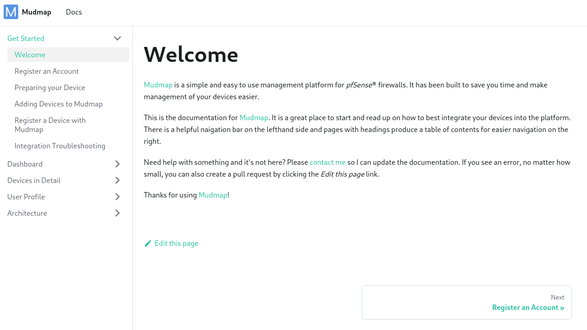
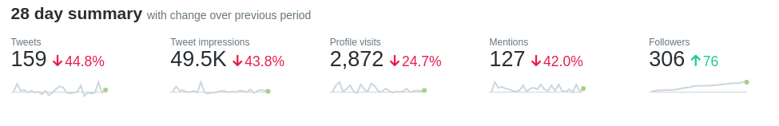
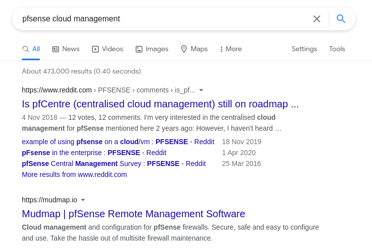

+++
date = "2021-06-06"
categories = ["retrospectives"]
tags = ["retrospectives"]
slug = "retrospective-may-2021"
title = "May 2021 Retrospective"
draft = false
+++

# Summary

A month of ups and downs, at least mentally and emotionally. At the start of May, I was *days* 
from launching [Mudmap]. That turned into a mental hell hole as I encountered several bugs that 
weren't apparent until in production - bad programmer, bad! Deployment woes with providers and 
other frustrations. After a lot of persistence and some *back-to-the-drawing-board* thinking, I 
eventually deployed the app. The month ended on a bit of high with some things falling into 
place outside of [Mudmap] which I might talk about in the next Retro.

## Highlights

- Deployed [Mudmap] Beta into the wild
- Discovered [Render] and am now a convert
- Stood up the docs using [Docusaurus] and started flirting with [Next.js]

## Goal Performance

A review of last months three goals. See [April's Retrospective][old-retro]

### Launch Mudmap

- **Appraisal**: It's live but still got a few kinks to iron out
- **Rating**: B

I think this has been on my list for the last two months. Perhaps, I was a 
little hasty or overconfident in the beginning, but I'm happy to say its 
now live. There are still some issues to sort out but users can sign up and 
look around.

A few issues presented during the deployment, which lead to a lot of trial 
and error testing. My original plan of a digital ocean backend and netlify 
frontend proved painful. This could be equated to my lack of skill in this 
area though. Eventually, I tried out [Render] after several recommendations.

Almost  immediately things improved. Having the ability to push new builds 
and see the output is super helpful. My old method was to build on the VM 
(using a CI Runner) after tests passed. It works, but it's a lot of 
setup, and it was this initial setup that was punishing. Cross-origin 
requests were also beating me up as well.

Eventually with [Render] I was able to stand up all the services and static 
pages, including domains inside a single yaml file. Render's 
Infrastructure as Code capability is really sweet and should help to 
prevent redeploys missing some toggle that was clicked in a GUI and long since forgotten about.

As always, if interested, check it out [Mudmap here][mudmap]

### Start the documentation pages

- **Appraisal**: Live and being indexed by Algolia
- **Rating**: A

Before the end of the month I was able to stand up Mudmap's documentation 
pages using [Docusaurus]. I highly recommend the framework, it's the easiest 
tool I have used by far for this type of thing. The setup took about an hour or
maybe two (optimistic memory aside) which for a javascript framework is really 
good! Writing the detailed documentation with images, much longer.

Mudmap's documentation isn't complete, but the most important pages are. I am 
making an effort to write a portion of a page every day as I feel Mudmap 
needs good docs. It's a complex system with several moving parts for users to configure before they 
get started using the application.

You can read more [here][docs-prep] to see what I mean. 

It is also hosted on [Render] as a static site for free. 💰

Check them out at [docs.mudmap.io][docs]

If looking for a knowledge base tool that you can be hosted, I would 
consider [Docusaurus] one of the best. Really simple but elegant and has 
support for search through either self-hosted or managed Algolia. 

I think it looks great 👇

### Replace the pricing page, and if possible, embed it in Hugo as a React component

- **Appraisal**: I'll go one better! Replace the landing page
- **Rating**: C+

I ended up looking at rewriting the entire landing page rather than trying to fit 
React into Hugo. Now, I do love Hugo - this is a Hugo blog though most of 
my work is between python and javascript. So I wanted to decrease any 
possible mental context switching between languages and frameworks. It's also a great 
opportunity to make the site 
more aesthetically pleasing. 

Technically, I didn't complete this goal. I did find another way to achieve 
a better result, so I'm being favourable to myself in the rating.

End state, love Hugo but want to unify the language stack I am using, so 
I'll be switching to React/Next.js

## Recommendations

If you're on Discord and looking for a great Maker/Indie Hacker like community, I recommend 
[Lunadio]. I recently participated in one their weekly Mastermind calls and it was really 
interesting and great to hear others in a similar position as me. The Discord channel is also 
full of interesting people solving problems and sharing what they've learnt with everyone else. 
Admittedly, I could be more active on there but even in a passive capacity (which I don't 
recommend; get involved 💪) its super useful.

### Twitter

I've really started to get involved in sharing my journey on Twitter. It's been really helpful 
for my personal development - you meet and talk to soo many great folks. Several times I've 
reached out and asked questions of those around me, and it has ended up being more valuable to me 
than I'd ever expected. 

My "*stats*" are down in everything but followers, though I don't really care because I'm having 
fun and making friends.

May saw me join in a Twitter experiment created by [@MeetKevon][kevon] called 
[#30DaysinPublic][30dinpub]. It's been great. Every second day [Kevon] sends an email with a 
*Twitter task*, which is to write a themed tweet. Having a task and then having to think of 
things to tweet about that has been great for my ability to think of sharable items. Usually, I 
think everything I do isn't worth sharing - its probably boring, or been done many times over. 
Being held to account and committing to a cause has really helped overcome that - who cares if 
what I tweet *is boring*. If people don't want to read it, or don't like me that's fine and 
welcomed, after all, getting people to like you is not *your [task]*. 

## Wrap up

**What can I do better?**

- Project/Task Management 

I am bit all over the shop with this. I have Notion but its a bit *heavy* and *clicky* for me 
sometimes. I'm a Vim guy, mice scare me.

- Kill off distractions.

I've read Cal Newport's books - an aside, I think [So Good They Can't Ignore You][cal-book] is 
far superior to [Deep Work][cal-deep]. Distractions are ever present, but I really need to switch 
off that time-sink/mind-rot machine called a phone when I *actually* want to get work done. Days 
where I replace the phone in my pocket with a notebook and pen are far more productive.

Getting real off-topic. I had an idea a few months back about a product which is basically a box 
you put all the families phones in. It has a timer and once set, locks the box until that time 
(or an emergency override is hit). If I could be arsed, I make it and call it **Family Time**.

**What have I done well?**

- I pushed through and got [Mudmap] into the wild
- Segmented my time quite well between development, writing docs, and planning the next items

### Google ranking

Nearly forgot but checking my Plausible stats, I noticed there is some google search terms that 
pop up frequently. I did a search using a VPN and in incognito mode (just to be sure) and Mudmap is 
Second!

## Next month's goals

- Add a Rule set feature to Mudmap
- Email 5 prospects
- Reinvigorate an old project that I plan to monetize (long term SEO play now for reward later)

## Analytics







[mudmap]: https://mudmap.io/?utm_campaign=retro-may-21&utm_source=danielms&utm_medium=blog
[docs]: https://docs.mudmap.io/
[docs-prep]: https://docs.mudmap.io/preparing-devices
[docusaurus]: https://docusaurus.io/
[render]: https://render.com
[next.js]: https://nextjs.org
[lunadio]: https://www.lunadio.com/ 
[kevon]: https://twitter.com/meetkevon
[30dinpub]: https://twitter.com/search?q=%2330daysinpublic 
[task]: https://www.amazon.com.au/Courage-Disliked-Japanese-phenomenon-happiness-ebook/dp/B06XSGNN61
[cal-book]: https://www.amazon.com.au/Good-They-Cant-Ignore-You/dp/1455509124
[cal-deep]: https://www.amazon.com.au/Deep-Work-Focused-Success-Distracted/dp/0349411905/
[old-retro]: https://danielms.site/retrospectives/2021/retrospective-april-2021/
