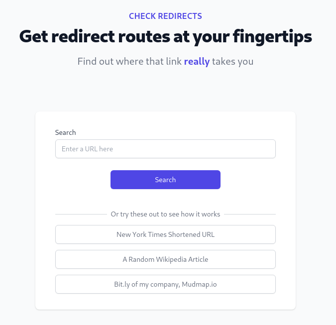
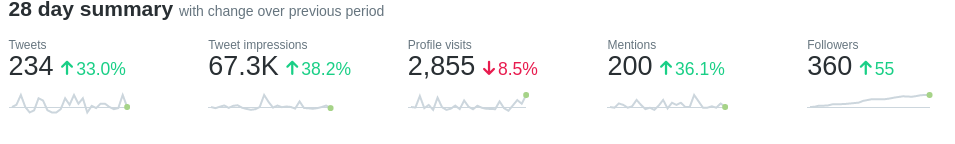

+++
date = "2021-07-02"
categories = ["retrospectives"]
tags = ["retrospectives"]
slug = "retrospective-june-2021"
title = "June 2021 Retrospective"
draft = false
+++

# Summary

I spent less time on Mudmap this month and relaunched an old project, [Check-Redirects.com][cr.com]. Taking a breather from Mudmap and switching gears worked well. I feel much more motivated about the project and in the last few days have done a lot of solid work on it. Nothing comes for free and the price I paid was failing to fulfill one of my goals from last month.

## Highlights

- Dropped a new product.
- Next.js and I are becoming good friends.
- Mudmap had a small spike of interest at the beginning of the month but it petered out.

## Goal Performance

A review of last month's three goals. See [May's Retrospective][old-retro]

[old-retro]: https://danielms.site/retrospectives/2021/retrospective-may-2021/

### Add firewall rules to Mudmap

- **Appraisal**: Time got away from me and this didn't get done
- **Rating**: D

I *did* spend a couple of hours writing out some ideas of how this will get done. They were rough designs and scribbles so nothing of real substance. I'm not even sure I know where the sketches would be. Nonetheless, I do have an intuition of how it's going to look and feel for the user.

The amount of work needed to make this isn't much and would offer another great feature for [Mudmap]. Prioritizing this for July.

### Email 5 prospects

- **Appraisal**: Emailed with some minor correspondence but mostly crickets
- **Rating**: B

Several users have signed up for access to [Mudmap] though none have committed to paying for the service. I emailed every single sign-up with extra details and asking for feedback if they feel so inclined. It is a very small sample size but so far only one replied with a feature request. 

The feature is not unwarranted and something I will eventually offer all customers as standard; static IPs for SSH targets. Unfortunately, my hosting platform, [render.com](https://render.com), does not offer this, yet. The workaround is to place a [load balancer](https://www.quotaguard.com/) in front of my server and point users at that. This option isn't free, add latency, and I have not tested the effectiveness of SSH communications through it. More customer data is needed to ascertain how high of a priority it is before I drop other things to complete this.

Although I've sent out a few emails those emails were to my warm network - anyone who has signed up has already found [Mudmap]. I need to go after a cold network and start planting Mudmap in people's minds. So far, my lack of conversion from sign up to paid is because I'm not reaching out to more people.

### Reinvigorate an old project that I plan to monetize 

- **Appraisal**: Successfully re-launched [check-redirects.com][cr.com]
- **Rating**: A

I've come to terms with it. I like building products around network analysis and security. So after chatting with [@Ruurtjan](https://twitter.com/Ruurtjan) and
[@andreas_zettl](https://twitter.com/andreas_zettl) about our love for these tools, I decided to take a breather from Mudmap and refactor [check-redirects.com][cr.com]. We have a discord for network tool builders - [DM](https://twitter.com/dansult) or [email](mailto:dan@danielms.site) me for the link.

### What is it?

It is a tool that lets you plug in a URL and quickly get the final URL without having to traverse all the redirects. In doing that, you can analyze each hop along the path including the location data, headers, response body, and latency. 

**A few use cases:**

- Checking a shortened links legitimacy
- Bypassing ad networks
- Circumventing network security policies that prevent certain URL's from being opened, for instance, trackers from newsletter sign up pages and the like
- Ascertaining how many redirects you're introducing into your application (Google cares about too many 301's for instance)
- Determining referral links, and if they're working as expected

The original site was built using Vuejs, though this time I opted to use [Next.js](https://nextjs.com?ref=danielms.site) as I am now more familiar with React. I figured this was a good opportunity to build another application with it - I build Mudmap's landing page with it last month. This app needed to interface with an API so it felt like a natural stair-step into bigger apps in the future.

Honestly, so glad I used Next. It's just a great platform and after about 6 weeks of playing around with it, I am convinced it's better than *plain* React. I grok the file-based router whereas `react-router-dom` feels weird to me and got me with a couple of foot guns when writing Mudmap's dashboard. As a solo developer, I value good *Developer Experience* and Next has a great one. They also released Next11 whilst writing it. I upgraded from version 10 to 11 and got their awesome `Image` updates without a hiccup, which for a javascript framework is often not the case.

### Why divert time from Mudmap?

I want to place multiple bets and explore many different avenues of income generation. I am still employed full-time so these projects are not my sole source of income, which gives me the space to try things and spread myself out a bit. I tend to get a little task fixated which can cause issues so switching to another objective for a short period lets my motivation banks recharge for the thing that's not being worked on. 

Having two different projects on the go is also a means to explore two different models; subscription and affiliate/ad streams. Mudmap is a typical SaaS subscription-based application but [check-redirects.com][cr.com] is not, letting me branch out creatively. This fits better with my self-image as I believe I am a generalist - not excelling at one particular thing but being familiar with many different modalities. 

This is something I embraced (but also at times disliked) about my old job in the army. We were across so many tasks but at any one moment not particularly great at any of them. You can't be an expert diver, driver, sniper, demolitionist, parachutist, or whatever all at the same time. You have to re-train the skills when needed. The time between average to good decreases the more you practice this style of *rapid upskilling*. I am a big believer in [T-shaped skills][t] but I also know that the leg of the T is in constant flux. At least for those that *actively* adopt this approach to life.

## Recommendations

I like listening to podcasts and audiobooks on my commute to the office.

This months book:

- [Company of One][coo]

Worth a listen if you're aren't looking to scale into a massive business. I couldn't do it justice in a short paragraph but so far its an enjoyable listen.

*Sidenote*: I want to listen to Phil Jacksons' book, [Eleven Rings][11rings] on Audible. Unfortunately, it seems to be unavailable to Australian's which kind of pisses me off. 

Podcast of the month:

- [Confidence] by [My First Million podcast][mfm]

10 minutes or so by [@theSamParr](https://twitter.com/theSamParr) on how he became so confident. Spoiler, it was a *choice* - a learned behavior. I loved how he explained it and have been telling a lot of friends to give it a listen.

Also, my mate just dropped a couple of clips on youtube from his holiday to New Zealand before our recent (silly) lockdowns here in Australia. He's got a quirky style but makes me laugh and sometimes cringe. [PeskyPas] if you want to watch.

## Wrap up

*I can't believe its July already* 🙃

**What can I do better?**

- Get out of my developer comfort zone and engage with potential customers

If I don't do this my product will die. That's it. 

- Stick to the month's goals

I can get carried away and miss the objective of the month as I've set it out here. To fix that, I'm just writing them down and sticking them to a post-it note on my monitor.

**What have I done well?**

- Re-launched an old product and recharged the Mudmap motivation banks
- I've been pretty good at listening to my body and mind this month. 

When I've needed extra rest, I've taken it. Also increased my exercise and committed to a gym by using money as a psychological weapon - I'm a tight arse and hate parting with money. So, knowing how much each day I don't train costs me is a great motivator.

## Analytics

**Twitter**

I put this here for my future reference.







## Next months goals

- Cold email at least 15 people
- Add Firewall rules to Mudmap
- Record some videos for onboarding new clients

[mudmap]: https://mudmap.io/?utm_campaign=retro&utm_source=danielms&utm_medium=blog
[cr.com]: https://www.check-redirects.com/?utm_medium=social&utm_source=danielms&utm_campaign=retro-june-2021
[t]: https://en.wikipedia.org/wiki/T-shaped_skills
[confidence]: https://podcasts.apple.com/us/podcast/mfm-mini-the-way-to-be-confident/id1469759170?i=1000525326147
[coo]: https://www.amazon.com.au/Company-One-Staying-Small-Business/dp/1328972356
[mfm]: https://podcasts.apple.com/us/podcast/my-first-million/id1469759170
[11rings]: https://www.amazon.com.au/Eleven-Rings-Success-Phil-Jackson/dp/0143125346
[peskypas]: https://www.youtube.com/watch?v=k0iBaniEHX0&ab_channel=PeskyPas
