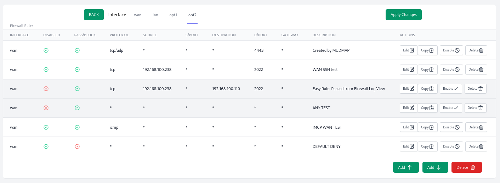
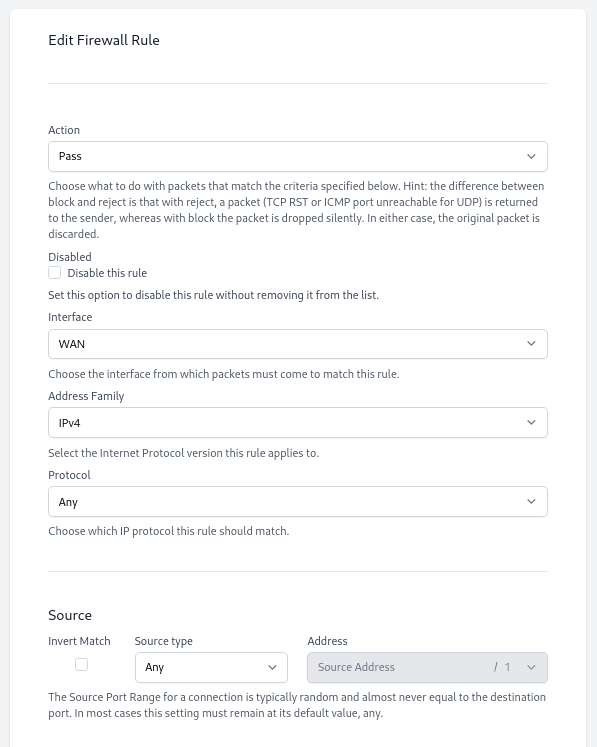

+++
date = "2021-09-01"
categories = ["retrospectives"]
tags = ["retrospectives"]
slug = "retrospective-aug-2021"
title = "August 2021 Retrospective"
draft = false
+++

# Summary

Productivity took a nosedive this month, as did my own mental health. Thankfully it's rebounding 
and I'm mostly back on my own schedule and feeling good.

## Highlights

- Setup my own [Sentry](https://sentry.io) server
- Enabled [Upptime](https://status.mudmap.io/) monitoring for [Mudmap]
- Took a week off to learn some Golang

## Goal Performance

A review of last months goals. See [July's Retrospective][old-retro]

[old-retro]: https://danielms.site/retrospectives/2021/retrospective-july-2021/

### Release firewall rules page

- **Appraisal**: Did not complete this
- **Rating**: C (it's looking great though...)

This page is really starting to take shape and works well but is still a work in progress. The 
amount of work in creating nice forms was underestimated. 

An example of what the rules page overview will look like. The styling and fields for the table 
are still in flux but the framework is there. The nice thing about building it in javascript is 
how snappy it feels when jumping between interfaces.

The *edit rule* form is also coming along. The slowness has come mostly from me figuring out the 
conditionals and `react-hook-form`. For instance, if the source is *any* then no source address 
or CIDR ranges should be applied. However, a single host source address requires a source 
address but *not* a CIDR range, and a source network requires both an IP source address *and* 
CIDR. The form is littered with those sorts of distinctions and its sometimes a bit of grind 
working through those and other edge cases - [ICMP], I'm looking at you.

### Write a Mudmap blog post

- **Appraisal**: Did not publish this
- **Rating**: D

The post is pretty big but not finished yet. I could release it over a few parts but would 
prefer to make it a long-form post. Still a bit to do and finding time for it was hard this month.

## A rough patch

No denying it, this month was tough on me mentally. A number of things that have been  
background noise over the last year suddenly came to the forefront of my mind. It brought my 
productivity to halt and put me in a bad place. This can happen to anyone for any reason in 
their life, and as a solo developer, there isn't anyone else to pick up the slack. 

The two biggest pieces that affected me were:

- Australia's dip into oppression over Covid
- Afghanistan and the treatment of men like me

### Lockdown

The first couple of weeks of being reduced to one hour of outside activity hit me harder than 
expected. Sounds easy at first but having young children and a relatively small house means 
there is *no escape* from the chaos (and joy) that kids bring. On paper, it seems fine, just a 
routine; wake up, walk to the coffee shop as a family, walk home, find things to entertain a 
child all day without going outside or anywhere. Except both parents also have full-time work. 
After the second week we have settled into a bit of a routine - it's not perfect, but it's working. 
Still, it's not great for my girl who loves her friends and is very active - kids and adolescents 
are paying a high price, so much that child suicide is now being normalised. 

### Afghanistan

If you've turned on the news (hopefully you didn't watch it for too long! mind-rot that stuff) 
you've likely seen the Afghan coverage. I did my service in the country and am proud of it - 
perhaps the best times of my life were there. For a professional soldier, fighting is something 
you *want* to do, not something you *endure*. The hardest pill to swallow with the withdrawal 
has been the number of conversations with people who are overnight geopolitical experts. Asking 
me things like "how does it feel to know it was all a waste of time" or "would you say that it 
was worth it?". These questions betray the asker's naivety about the nature of combat and 
soldiers or dare I say, warrior culture.

The fall of Afghanistan was not if but when. Not only that but it *is* what the media and public 
have wanted since the late 2000s. Let them stand up on their own two feet and hand over power - 
Hamid Karzai was inserted with the Green Berets in 2001 to start the removal and handover of 
power. It was not unexpected yet the media went to town on the predicament, blissfully ignorant 
to the many factors at play. As long as they get some clicks and outrage - the end justifies the 
means, right?

There is more to this story but that is all I am comfortable sharing today. At the end of 
the day, a few things compounded over a couple of weeks that had a real effect on me, and it 
shows up in this retrospective and my performance.

## Recommendations

A couple choice things I've discovered this month.

[Fantastic fungi](https://www.youtube.com/watch?v=bxABOiay6oA&ab_channel=MovingArt)

A really interesting documentary - easy watching yet intriguing. Perhaps the most interesting to 
me was the fusion of mushroom spore with termite insecticide. Maybe I need to increase my 
variety of mushrooms instead of just the woolies button mushroom!

[Dune](https://en.wikipedia.org/wiki/Dune_(novel))

A book that everyone has heard of. After reading [The Three Body Problem](https://en.wikipedia.org/wiki/The_Three-Body_Problem_(novel))
I found that reading science fiction before bed was really relaxing and helped me to unwind. So, 
I deceided to tick off a few of the *must read before you die* type sci-fi titles. I'm about 
half way through the first book and look forward to reading it every night. I'm unlikely to 
watch the movie as every movie adaptation of a good book has been terrible, Ready Player One - I 
want my money back please. But, I might have watched it if I hadn't read it first and am glad I 
finally got around to it.

## Wrap up

A bit of write off a month. Hopefully, this month is better!

**What can I do better?**

- Be more grateful; *get want you want and want what you get*.

**What have I done well?**

- I rebounded quite well at the backend of this month by letting go and venting with some friends over issues that plagued me. This release was more beneficial than I expected in hindsight.

## Next months goals

Repeating this month's goals.

- Release firewall rules page
- Write a Mudmap blog post

## Analytics

**Mudmap**

**Check-Redirects**

**Twitter**

[mudmap]: https://mudmap.io/?utm_campaign=retro&utm_source=danielms&utm_medium=blog
[icmp]: https://www.iana.org/assignments/icmp-parameters/icmp-parameters.xhtml
[bizarro world]: https://en.wikipedia.org/wiki/Bizarro_World
