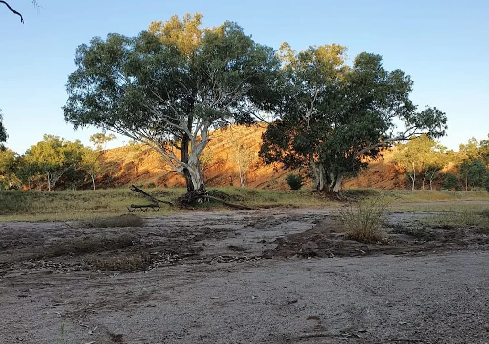

+++ 
date = "2022-05-04"
categories = ["retrospectives"]
tags = ["retrospectives"]
slug = "retrospective-april-2022"
title = "April 2022 Retrospective"
draft = false 
+++

# Summary

Recharged after a wonderful holiday spent visiting family and friends who we haven't seen since 
Covid started.

## Highlight

- Went on a relaxing holiday in [Alice Springs].

## Goal Performance

A review of last months three goals. See [March's Retrospective][old-retro].

[old-retro]: /retrospectives/2022/retrospective-march-2022/

### Push two Mudmap features to production

- **Appraisal**: I did push some very small fixes but nothing substantial
- **Rating**: C+

From the outset, I over committed myself this month. Nearly ten days of this month was spent on 
holiday where I did very little active development on Mudmap. Although, I did resolve some customer 
inquiries, analyse bug reports and speak with customers. 

A substantial update was released for the API that is installed on the firewalls. It was officially 
released at the end of the month but has been available in beta for several months. In 
preparation for this, I've been getting some things in order to make the transition easy. 
Included in the release is support for pfSense+ `v22.01` - something I did not expect to make it 
out of `beta`. 

In prep for this, I've been working on building a development environment and acquiring the 
authorizations to deploy pfSense+ testing devices. This includes local virtual machines and 
cloud instances. 

Other than that, I made some fixes to the user interface such as typo's on buttons. Mudmap's 
frontend will also ask users to refresh their page if a newer version is available whilst they 
are actively using it. Though I have found that caching on Next.js seems to intelligent enough 
to detect changes to the assets pretty quickly.

###  Walk to [Alice Springs] telegraph station

- **Appraisal**: Easy
- **Rating**: A

A silly goal but something I set purely to ensure I took my little girl on a decent walk through
some of Australia's most beautiful country.

I've had a few little holiday breaks here and there over the last year or so. None of them hold 
a candle to how relaxed and re-charged I feel after this one. Alice, is a remarkable little 
place of only about 25,000 people, and stands in the centre of Australia. The nearest cities 
are [Darwin][rd] and [Adelaide][ra] both being about a 15-hour drive (click the links). 
Australia's vastness is hard to contemplate for many - driving 15 hours in Europe, Asia or the 
America's will have you passing by many large cities. In [Coober Pedy][cb], on the way to 
Adelaide, people live underground as it's literally too bloody hot on the surface! 

The picture below is from a short overnighter out bush - my daughters first night in a swag. She 
was absolutely thrilled to be sleeping under the stars and to wake up as the sun rises. In sum, 
it was a fantastic holiday with friends and family.

## Recommendations

**Learn Golang**

If you're a developer and looking to pick up a new language then you should have a 
look at Go. I had toyed around with it on and off for a while but started writing a lot more 
stuff in it towards the end of last year. Now, I reach for it whenever I'm starting something 
that is more than a *simple* bash script. There is a lot to love but for me, it's Go's ability 
to be compiled to any operating system and how easy it is to bundle assets (such as HTML) into 
the binary. Go is truly portable and after years with Python and Javascript, it is such a weight 
off my shoulders. Understanding the language can also be really helpful when figuring out errors 
with cloud tools too. After all, basically every cloud project these days is written in it.

## Wrap up

A quiet month on the *retrospective* front but a big month for me personally. Looking forward to 
writing a more lengthy post in June.

**What can I do better?**

- Be more time aware when making plans, i.e. I did not really factor in how little development work would get done one Mudmap during my holiday.
- Update the roadmap more frequently as this is something users are asking about often.
- Release the monthly retro in a more timely manner.

**What have I done well?**

- Actually took a proper amount of time off and feel recharged
- Spent sometime exploring a few other programming projects

## Next month's goals

- Deploy pfSense+ capable Mudmap 
- Get started on multi-account support (a big customer request)

## Analytics







[wgd]: https://whatgotdone.com
[mudmap]: https://mudmap.io?ref=danielms.site
[cb]: https://en.wikipedia.org/wiki/Coober_Pedy
[ra]: https://www.google.com/maps/dir/alice+springs/Adelaide+SA/@-29.2375669,131.3978583,6z/data=!3m1!4b1!4m14!4m13!1m5!1m1!1s0x2b321944be8f1331:0x50217a82a254fd0!2m2!1d133.8807471!2d-23.698042!1m5!1m1!1s0x6ab735c7c526b33f:0x4033654628ec640!2m2!1d138.6007456!2d-34.9284989!3e0
[rd]: https://www.google.com/maps/dir/alice+springs/Darwin,+Northern+Territory/@-18.0133453,128.0649485,6z/data=!3m1!4b1!4m14!4m13!1m5!1m1!1s0x2b321944be8f1331:0x50217a82a254fd0!2m2!1d133.8807471!2d-23.698042!1m5!1m1!1s0x2cc0a0fc9f59043f:0x30217a82a247c20!2m2!1d130.8444446!2d-12.4637333!3e0
[telegraph station]: https://en.wikipedia.org/wiki/Alice_Springs_Telegraph_Station
[alice springs]: https://en.wikipedia.org/wiki/Alice_Springs
